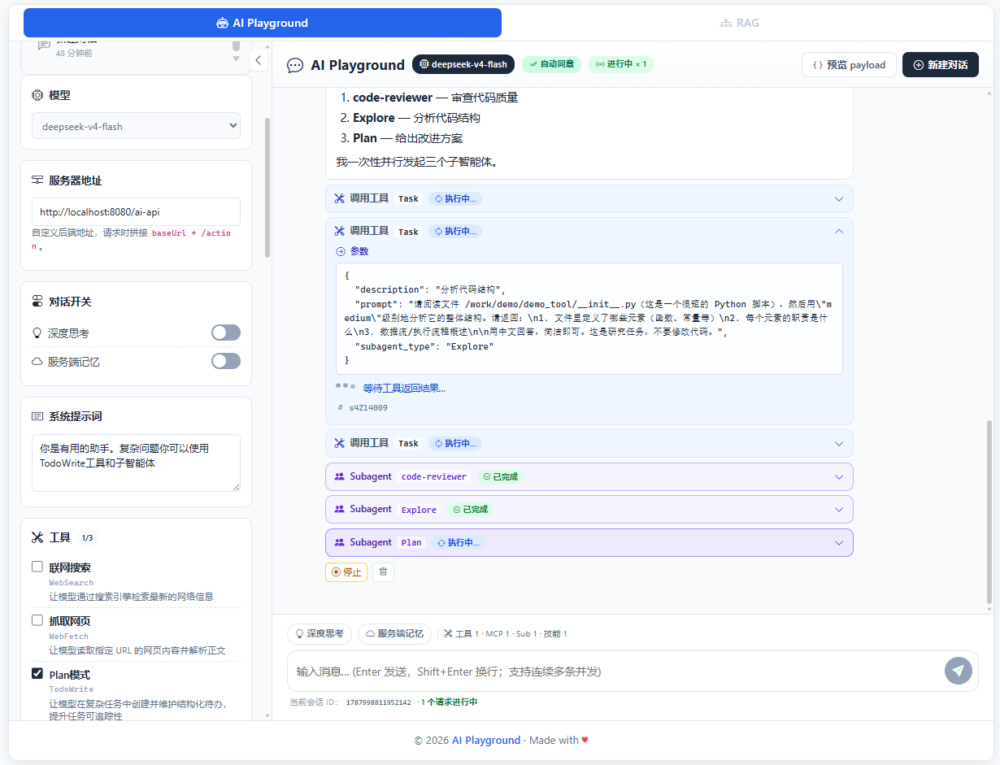
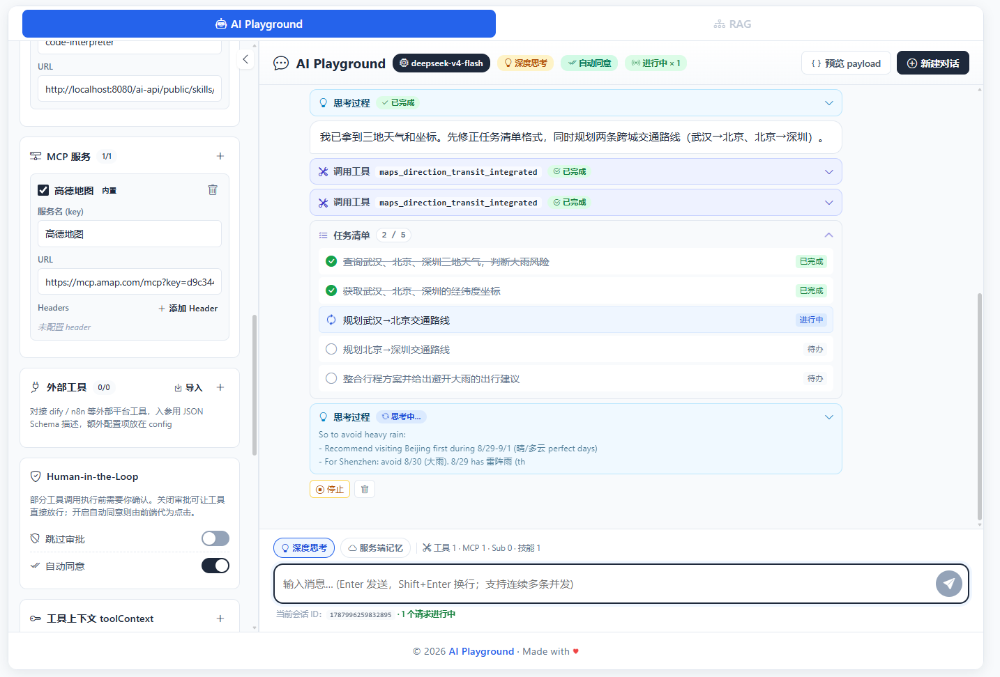
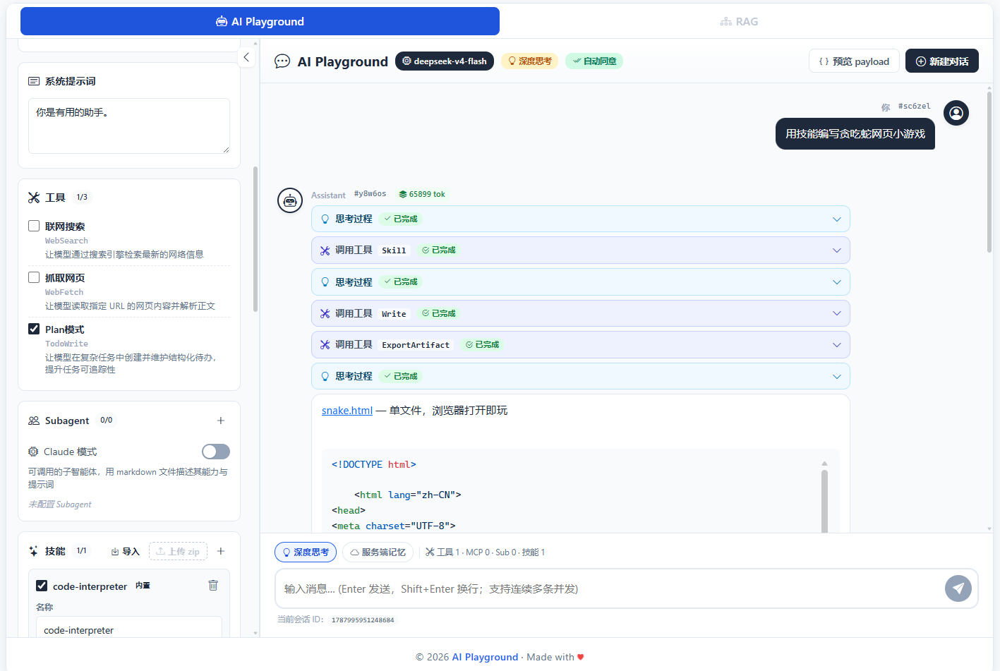
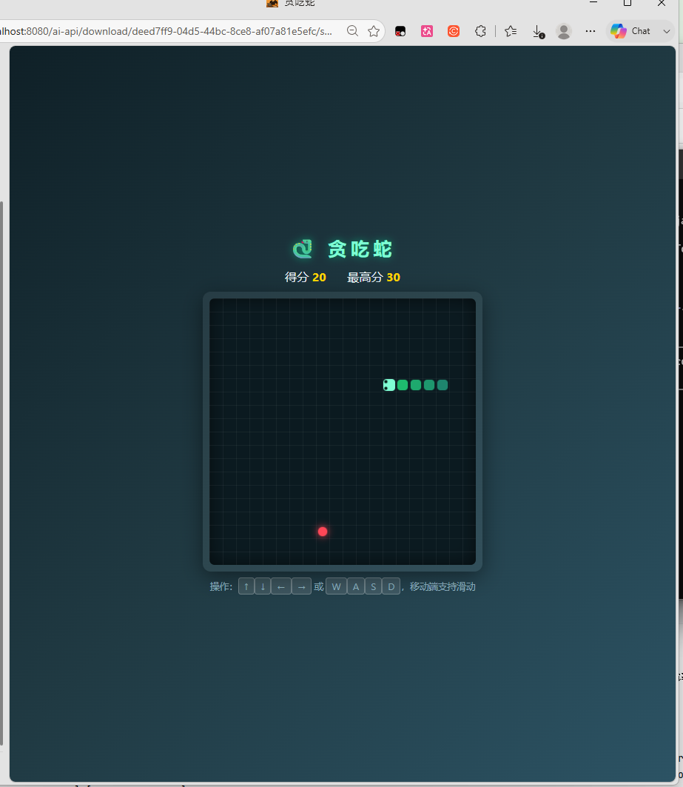
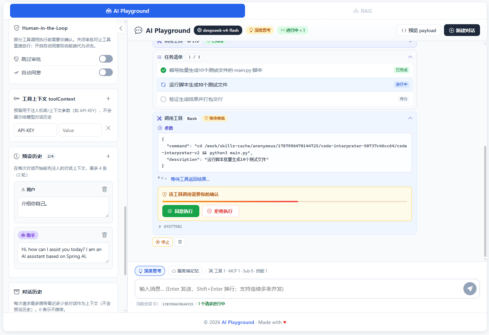
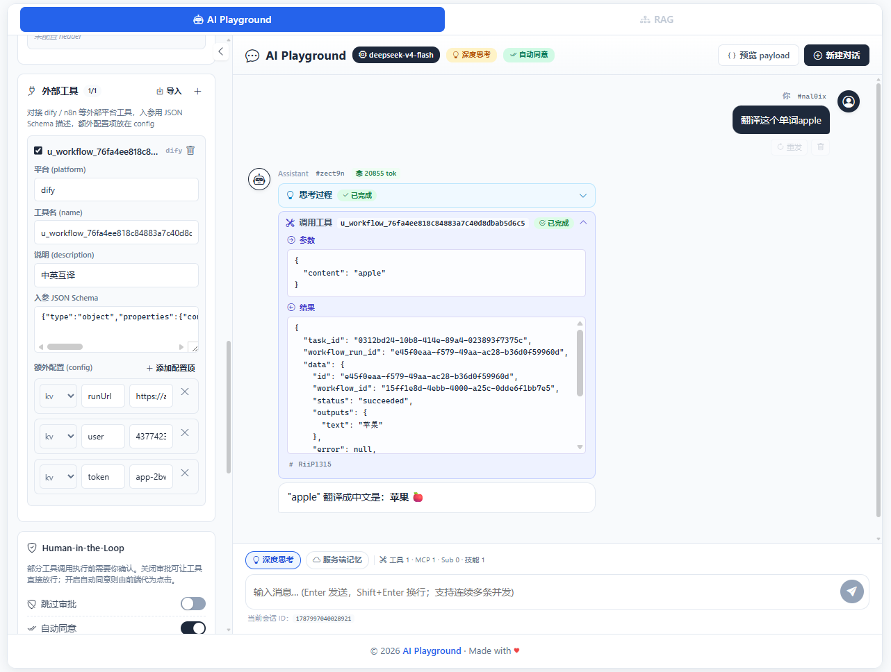

# hermes-agent-demo

[中文](README.md) | **English**

  ---
A multi-model Agent runtime built on Spring Boot 4 / Spring AI 2.0.1. Supports Anthropic / DeepSeek / OpenAI and custom model integration, with sub-agents, hot-pluggable Skills, Docker sandbox + Code Interpreter, MCP tool ecosystem, dify / n8n external tool platforms, RAG knowledge base, and
Human-in-the-Loop approval — streaming the full execution process to the frontend as structured SSE events.

  ---

## Demo

### Subagents + MCP

Delegate multi-step tasks to subagents with isolated context, optionally augmented with MCP external tools (e.g. Amap); progress streams live:



### TODO task list (TodoWrite / Plan mode)

Complex tasks are first turned into a todo list, then worked through item by item with live status:



### Snake Code Interpreter (run model-generated code in a sandbox)

The model generates code → runs it in the sandbox → exports the result as a previewable/downloadable artifact:





### Human-in-the-Loop (tool approval)

Tool calls hitting the `Write`/`Edit`/`Bash` whitelist prompt for approval before executing:



### External tool platforms (dify / n8n)

External workflow integration is reserved via `externalTools` + API, exposed as tools_call invocations:



---

## Contents

- [Features](#features)
- [Quick Start](#quick-start)
- [Core Concepts](#core-concepts)
- [API](#api)
- [Configuration](#configuration)
- [Architecture](#architecture)
- [Build & Deploy](#build--deploy)

---

## Features

| Feature | Description |
|---|---|
| **Multi-model routing** | `modelName` prefix routes to Anthropic / DeepSeek / OpenAI / a custom model |
| **Thinking mode** | `thinking: enabled/disabled` maps to each provider's native switch (Anthropic budget, DeepSeek `reasoningContent`, OpenAI `reasoningEffort`) |
| **Server memory** | `useServerMemory` enables server-side `ChatMemory` persisted by `sessionId`; otherwise stateless `history[]` |
| **Tool-call loop guard** | `maxToolIterations` caps tool calls per turn; graceful finish without breaking SSE |
| **Human-in-the-Loop** | Whitelisted tool calls require SSE approval; `bypassApproval` skips per request |
| **Hot-pluggable Skills** | Upload zip skill packages per request; scripts run inside the sandbox |
| **Subagents** | Claude-style `.md` subagents + 4 built-ins (general-purpose / Explore / Plan / Bash) |
| **MCP integration** | Connect MCP servers per request, reuse the external tool ecosystem |
| **External tool platforms** | Integrate dify / n8n etc. via `platform`/`name`/`description`/`inputSchema`/`config` |
| **RAG** | pgvector store + rerank + hybrid retrieval |
| **Observability** | `token` / `reasoning` / `tool_call` / `tool_result` / `approval_request` / `subagent_*` event stream |

---

## Quick Start

### Prerequisites

- JDK 25+
- Docker (sandbox runs in Docker by default; pgvector also needs it)
- Maven 3.9+

### 1. Start dependencies

> **The database is optional.** RAG is a separate set of endpoints (`/ai-api/ai-health-assistant/...`, `/ai-api/document-parser/...`) — you only need pgvector when you use it. Plain chat / tools / sandbox don't need a database.

```bash
# Optional: start the pgvector store (5433) only when using RAG
cd docker/pgsql && docker compose up -d
```

### 2. Configure keys

Provide real API keys via environment variables, or create `src/main/resources/application.private.yaml` (already git-ignored):

```yaml
spring:
  ai:
    anthropic:
      api-key: sk-ant-xxxxxxxx
    openai:
      api-key: sk-xxxxxxxx
    deepseek:
      api-key: sk-xxxxxxxx
```

> All keys in the repo are `${XXX_API_KEY:sk-*******}` placeholders — the app starts fine, but real calls need a real key.

### 3. Run

```bash
# Dev (default profile is prod; switch to dev locally)
mvn spring-boot:run -Dspring-boot.run.profiles=dev

# Or package and run the jar
mvn package -DskipTests
java -jar target/skills-tools-call-demo-1.0.0-SNAPSHOT.jar
```

Then visit:

- SPA frontend: `http://localhost:8080/` (or `http://localhost:8080/playground`)
- Built-in Skills / Agents downloads (ready-to-use skill packages & subagent definitions; see `src/main/resources/public-download/`):
  - `http://localhost:8080/ai-api/public/skills/code-interpreter.zip`
  - `http://localhost:8080/ai-api/public/skills/archify.zip`
  - `http://localhost:8080/ai-api/public/agents/code-reviewer.md`

> **About the frontend**: the frontend is not open-sourced for now — `src/main/resources/dist/` only ships the built bundle (`index.html` + `assets/…`), not the source, since it's not professional-grade frontend code. This demo backend really only exposes one chat endpoint (`/ai-api/chat/stream`, plus approval backfill and downloads), so it's easy to rebuild a UI yourself with AI / vibe coding — just render the SSE event stream.

---

## Core Concepts

### Thinking mode

`thinking` is a tri-state field; the backend maps it to each provider's native switch:

| thinking | Anthropic | DeepSeek | OpenAI |
|---|---|---|---|
| `enabled` | `thinkingEnabled(10000)` + `maxTokens(16384)` | `thinking(ENABLED)` + `reasoningEffort(HIGH)` | `reasoningEffort("high")` |
| `disabled` | `thinkingDisabled()` | `thinking(DISABLED)` | `reasoningEffort("minimal")` |
| omitted / other | provider default | provider default | provider default |

`modelName` is always passed through to the upstream. DeepSeek's thinking output lives in the separate `reasoningContent` field and is extracted uniformly by `ReasoningExtractor`.

### Server memory (useServerMemory)

- `false` (default): stateless — the caller sends the full history in `history[]`.
- `true`: server manages history by `sessionId` via `MessageChatMemoryAdvisor`; `history[]` is ignored. The two modes are mutually exclusive.

### Tool iteration cap (maxToolIterations)

Guards against runaway tool-call loops. `null`/`≤0` keeps the official default (per-tool 40 / total 150); `≥1` tightens to a per-turn cap. On overflow, `ToolCallingAdvisor` finishes gracefully with `finishReason=toolCallLimitExceeded` instead of breaking the SSE stream.

### Chat history (history)

History can be provided in one of two ways:

- **Frontend-carried history**: send the last N messages in `history[]`; the server stays stateless.
- **Server-side memory**: set `useServerMemory=true` and the server manages history by `sessionId` — **the frontend no longer needs to send `history`** (it's ignored if sent).

```jsonc
// When useServerMemory=false (default), the frontend sends history each time:
"history": [
  { "role": 1, "content": "..." },   // 1 = user
  { "role": 2, "content": "..." }    // 2 = assistant
]
```

### System prompt

The request `system` field is the user persona, concatenated with the built-in `chat.prompt.system` (built-in first) and wrapped by `SystemPromptComposer` into an XML structure (`<context>` / `<builtin_rules>` / `<user_persona>`).

### Tool context (toolContext)

The request `toolContext` is a key-value map injected into tools **without** entering the model's conversation history or the tool JSON Schema:

- Built-in tools: visible via the `ToolContext` parameter;
- Skill sandbox scripts: exported as environment variables (keys upper-cased, invalid chars → `_`), readable in Python via `os.environ["API_KEY"]`.

Good for request-bound secrets like apiKey / tenantId.

### Custom model (mymodel)

Some model providers have no ready-made Spring AI starter — **you can extend Spring AI yourself**. `com.example.chat.mymodel` in this project is a complete example:

- `MyModelChatModel implements ChatModel, StreamingChatModel` — adapts a private HTTP API to Spring AI's model abstraction; just implement `call()` (sync) and `stream()` (SSE);
- `MyModelApi` — the private-protocol HTTP client layer, wrapping the `/call` / `/callStream` endpoints;
- `MyModelChatOptions` / `MyModelProperties` / `MyModelConfig` — custom options and wiring (`my-model.enabled=true` to turn it on);
- Routing via `ModelRouter`: a `modelName` starting with `qwen` / `glm` / `doubao` / `openai-compatible` / `my-` routes to the custom model — add your own prefixes as needed.

Once wired, the whole `ChatClient` stack (advisors, tool calling, memory, HITL) is reused with no other changes.

---

## API

Common prefix: `/ai-api` (applied to every `@RestController` by `WebConfig.configurePathMatch`).

| Method | Path | Description |
|---|---|---|
| `POST` | `/ai-api/chat` | Synchronous chat; returns a full `ChatResponse`（Deprecated) |
| `POST` | `/ai-api/chat/stream` | Streaming chat (SSE); returns a `ChatEvent` stream |
| `POST` | `/ai-api/chat/approval` | HITL approval backfill (`requestId` + `decision`) |
| `GET` | `/ai-api/download/{id}/{filename}` | Download an artifact (resolved by id; inline-previewable types render in place) |
| `GET` | `/ai-api/public/{*path}` | Public downloads (`src/main/resources/public-download/`) |
| `GET` | `/ai-api/ai-health-assistant/...` | RAG assistant |
| `POST` | `/ai-api/document-parser/parse-and-save` | Parse & ingest documents |

### Key request fields (ChatRequest)

```jsonc
{
  "query": "...",                     // required
  "modelName": "deepseek-reasoner",   // routes to the DeepSeek provider
  "thinking": "enabled",              // enabled / disabled / omitted
  "useServerMemory": true,            // server-side memory: no need to send history once enabled
  "sessionId": "s-xxx",
  "userId": 1001,
  "assistantId": 7,
  "system": "You are ...",            // user persona
  "tools": ["TodoWrite", "WebSearch", "WebFetch"],   // built-in tool whitelist
  "skills": [{ "name": "...", "url": "https://.../skill.zip" }],
  "subagents": [{ "name": "...", "url": "https://.../agent.md" }],
  "includeClaudeBuiltinSubagents": true,
  "mcpConfig": { "github": { "url": "...", "headers": {...} } },
  "externalTools": [{ "platform": "dify", "name": "...", "description": "...", "inputSchema": "{...}", "config": {...} }],
  "toolContext": { "apiKey": "sk-xxx" },
  "maxToolIterations": 25,
  "bypassApproval": false
  // "history": [...]                 // only sent by the frontend when useServerMemory=false
}
```

---

## Configuration

Key settings (`application.yaml`):

```yaml
spring:
  ai:
    anthropic:
      api-key: ${ANTHROPIC_API_KEY:sk-*******}
    openai:
      api-key: ${OPENAI_API_KEY:sk-*******}
    deepseek:
      api-key: ${DEEPSEEK_API_KEY:sk-*******}

chat:
  hitl:
    timeout: 3m                    # approval timeout; falls back to DECLINE
    heartbeat-interval: 15s        # SSE keep-alive
    required-tools:                # whitelist of tools needing approval (@Tool name, exact match)
      - Write
      - Edit
      - Bash

app:
  brave-search:
    api-key: ${BRAVE_API_KEY:sk-*******}     # WebSearch tool
  smart-web-fetch:
    enabled: true                            # WebFetch tool
  public-download:
    dir: classpath:/public-download/         # built-in Skills / Agents dir (packaged into the jar)
```

> Placeholder syntax: `${VAR:default}` — uses env var `VAR` if present, else the default. `sk-*******` is a placeholder: it starts fine but real calls return 401.

---

## Architecture

```
ChatController (HTTP)
   └── ChatService.assembleSpec          builds the ChatClient per request
         ├── ModelRouter                  routes by modelName prefix
         ├── SystemPromptComposer         builtin rules + user persona → XML system
         ├── Tool assembly                sandbox / builtin / Skills / MCP / external / FinalAnswer
         ├── HitlToolCallingGate          the single HITL gate (fail-safe)
         └── ObservableToolCallingManager side-channels tool results to the SSE sink
```

- **Streaming pipeline**: `Flux.using` (allocate → build → release) + `mergeWith(toolEventSink)` + `takeUntilOther(deadline)` with a 5-minute absolute cap.
- **Tool-event side channel**: Spring AI 2.0 GA hard-filters `hasToolCalls()` chunks from the streaming Flux, so `tool_call`/`tool_result` are emitted by `ObservableToolCallingManager.executeToolCalls` around tool execution, not from delta chunks.
- **Single HITL source**: `HitlToolCallingGate` owns the whole gate; the main agent and subagents reuse it via the thin `HitlEventFactory` adapters.

---

## Build & Deploy

```bash
mvn package -DskipTests
java -jar target/hermes-agent-demo-1.0.0-SNAPSHOT.jar
```

- The SPA build lives in `src/main/resources/dist/` — packaged into the jar, accessible in both dev and jar modes.
- Public files live in `src/main/resources/public-download/` — also packaged into the jar.
- To change public files in production without repackaging, point `app.public-download.dir` at an absolute disk path.

### Native Image (GraalVM)

For deployment, a **native image** is recommended (millisecond startup, low memory footprint). See the official Spring Boot guide:
[Developing Your First GraalVM Native Application](https://docs.spring.io/spring-boot/how-to/native-image/developing-your-first-application.html).

```bash
mvn -Pnative native:compile
./target/hermes-agent-demo
```

### About containerized deployment (⚠️ Docker-in-Docker not supported)

The sandbox in this project is based on `agent-sandbox-docker` — the code interpreter and Skills scripts are executed in containers **spawned on the host Docker daemon by the application itself**. This means:

- **You cannot run hermes-agent-demo inside a Docker container** — that would require nested virtualization (Docker-in-Docker), which is currently not supported.
- If the app must be started as a container, the sandbox implementation needs to be replaced with a non-Docker backend, such as:
  - **[CubeSandbox](https://github.com/TencentCloud/CubeSandbox)** — Tencent Cloud's open-source AI agent sandbox, hardware-level isolation via RustVMM + KVM, sub-60ms cold start, E2B-compatible API;
  - **[E2B](https://e2b.dev/)** — commercial hosted sandbox service with Firecracker microVM isolation, ready to use out of the box;
  - **[OpenSandbox](https://github.com/alibaba/OpenSandbox)** — Alibaba's open-source general-purpose sandbox platform for AI applications, supporting Docker / Kubernetes / gVisor / Firecracker runtimes with multi-language SDKs (including Java).

> **If you don't need the sandbox**: swap `SandboxGlobTool` for the upstream `org.springaicommunity.agent.tools.GlobTool` implementation (i.e. disable code interpreter / Skills sandbox execution) — the app can then be containerized directly.

### Multi-node deployment (Sticky Sessions)

The default local sandbox is **stateful**: `SandboxSessionManager` caches and reuses the same sandbox in node memory keyed by `(userId, assistantId, sessionId)`, so multiple turns of one conversation share its files and execution state. When running multiple replicas, requests of the same conversation must always be routed to the same node.

The recommended approach is an Nginx Sticky Sessions policy based on `assistantId + sessionId`:

```nginx
upstream hermes_backend {
    # sticky key = assistantId + sessionId
    hash "$arg_assistantId:$arg_sessionId" consistent;
    server 10.0.0.1:8080;
    server 10.0.0.2:8080;
}
```

> If the IDs live in the JSON request body instead of the query string, Nginx's native `hash` can't read them — use a cookie-based sticky policy (`sticky cookie` / `ip_hash`) instead, or have the gateway promote the IDs into headers and hash on those.

---

## References

- [Spring AI Reference](https://docs.spring.io/spring-ai/reference/index.html) — official reference docs
- [Subagents (Task / subagent)](https://spring.io/blog/2026/01/27/spring-ai-agentic-patterns-4-task-subagents) — Spring AI's official subagent pattern
- [Skills](https://spring.io/blog/2026/01/13/spring-ai-generic-agent-skills) — Spring AI's official take on skills
- [Spring AI Community](https://github.com/spring-ai-community) — community libs used here (`agent-sandbox`, `spring-ai-agent-utils`, ...)
- [JavaClaw / ClawRunr](https://clawrunr.io/) — reference for long-running background tasks & workspace & memory (to be implemented)
